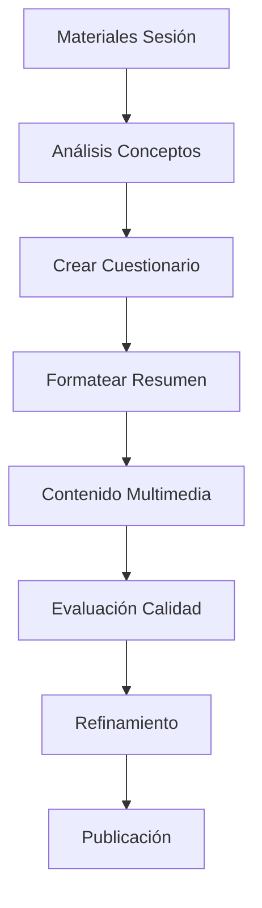
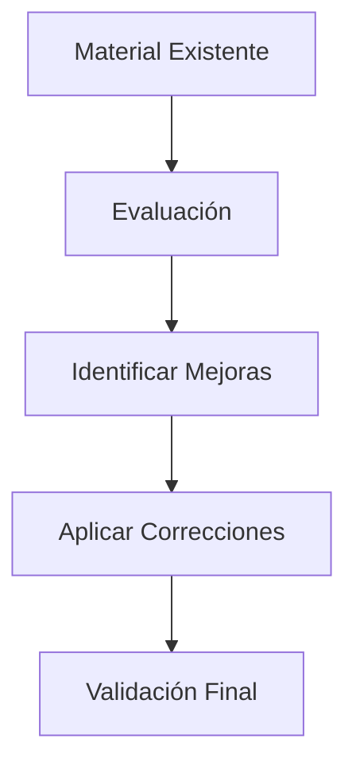

# 🗂️ Índice de Prompts y Herramientas - FCE Fundamentos de Datos

## 📋 Resumen Ejecutivo

Este directorio contiene prompts especializados y herramientas de comunicación optimizadas para diferentes agentes IA, diseñados específicamente para el proyecto "Fundamentos de Datos" de la Facultad de Ciencias Económicas (FCE) de la Universidad de Buenos Aires.

## 🎯 Prompts Principales

### 1️⃣ **[Cuestionarios](./cuestionarios-prompt.md)** 📝
**Objetivo:** Crear cuestionarios interactivos HTML con 80+ preguntas  
**Agente recomendado:** GitHub Copilot  
**Tiempo estimado:** 2-3 horas  
**Resultado:** Archivo HTML funcional completo  

```bash
# Uso rápido:
"Crear cuestionario sesión X sobre [TEMA] usando cuestionarios-prompt.md"
```

### 2️⃣ **[Resúmenes](./resumenes-prompt.md)** 📚
**Objetivo:** Formatear documentos de estudio con estructura visual atractiva  
**Agente recomendado:** Gemini/Claude  
**Tiempo estimado:** 30-45 minutos  
**Resultado:** Markdown optimizado para estudio  

```bash
# Uso rápido:
"Formatear este resumen usando resumenes-prompt.md para mejor legibilidad"
```

### 3️⃣ **[Multimedia](./multimedia-prompt.md)** 🎥
**Objetivo:** Crear contenido de audio/video y materiales de apoyo  
**Agente recomendado:** ChatGPT/Gemini  
**Tiempo estimado:** 1-2 horas  
**Resultado:** Scripts, transcripciones, elementos visuales  

```bash
# Uso rápido:
"Crear guión audio sesión X usando multimedia-prompt.md"
```

### 4️⃣ **[Evaluación](./evaluacion-prompt.md)** ✅
**Objetivo:** Revisar y validar calidad de materiales educativos  
**Agente recomendado:** Claude  
**Tiempo estimado:** 45-60 minutos  
**Resultado:** Reporte detallado con matriz de calificación  

```bash
# Uso rápido:
"Evaluar este material usando evaluacion-prompt.md y generar reporte"
```

### 5️⃣ **[Mejores Prácticas](./mejores-practicas.md)** 🤖
**Objetivo:** Guía estratégica para optimizar comunicación con agentes IA  
**Tipo:** Documento de referencia  
**Uso:** Consulta permanente para todos los flujos de trabajo  

## 🔄 Flujos de Trabajo Recomendados

### 🎯 **Flujo Completo: Nueva Sesión**


### ⚡ **Flujo Rápido: Mejora Material Existente**


## 📊 Matriz de Decisión de Agentes

| Tarea | Copilot | Gemini | Claude | ChatGPT | Cursor |
|-------|---------|--------|--------|---------|--------|
| **Cuestionarios HTML** | 🟢 | 🟡 | 🟡 | 🟡 | 🟢 |
| **Formateo Resúmenes** | 🟡 | 🟢 | 🟢 | 🟡 | 🔴 |
| **Análisis Contenido** | 🟡 | 🟢 | 🟢 | 🟡 | 🔴 |
| **Scripts Multimedia** | 🔴 | 🟢 | 🟡 | 🟢 | 🔴 |
| **Evaluación Calidad** | 🟡 | 🟡 | 🟢 | 🟡 | 🔴 |
| **Código/Debugging** | 🟢 | 🟡 | 🟡 | 🟡 | 🟢 |

**Leyenda:** 🟢 Excelente | 🟡 Bueno | 🔴 No recomendado

## 🛠️ Herramientas de Apoyo

### 📁 **Templates Base**
- `sesion-template.md` - Estructura base para nuevas sesiones
- `cuestionario-template.html` - Esqueleto HTML para cuestionarios
- `evaluacion-template.md` - Formato estándar de evaluación

### 🔧 **Scripts de Automatización**
- `validate-questions.js` - Validar estructura de preguntas
- `format-checker.py` - Verificar formato de documentos
- `quality-metrics.sh` - Generar métricas de calidad

### 📊 **Checklists de Calidad**
- ✅ **Pre-publicación:** Verificaciones antes de publicar
- ✅ **Post-creación:** Validaciones después de crear contenido
- ✅ **Mantenimiento:** Revisiones periódicas de materiales

## 🎓 Estándares Académicos FCE

### 📚 **Nivel de Contenido**
- **Universitario:** Apropiado para estudiantes FCE-UBA
- **Riguroso:** Basado en fuentes académicas verificadas
- **Práctico:** Aplicable a contexto empresarial argentino
- **Actualizado:** Conforme a estándares internacionales

### 🎯 **Objetivos Pedagógicos**
- **Comprensión:** Facilitar entendimiento de conceptos complejos
- **Aplicación:** Conectar teoría con práctica empresarial
- **Análisis:** Desarrollar pensamiento crítico
- **Síntesis:** Integrar conocimientos de diferentes sesiones

### 📊 **Métricas de Éxito**
- **Precisión:** 0 errores académicos detectados
- **Completitud:** 100% de objetivos de aprendizaje cubiertos
- **Usabilidad:** Funcionalidad perfecta en todos los dispositivos
- **Engagement:** Alta participación estudiantil

## 🚀 Roadmap de Desarrollo

### 📅 **Fase 1: Establecimiento (Completado)**
- ✅ Prompts base creados
- ✅ Estructura de archivos definida
- ✅ Flujos de trabajo establecidos
- ✅ Documentación completa

### 📅 **Fase 2: Optimización (En curso)**
- 🔄 Refinamiento basado en uso real
- 🔄 Métricas de performance implementadas
- 🔄 Automatización de procesos rutinarios
- 🔄 Expansión a sesiones restantes

### 📅 **Fase 3: Escalamiento (Futuro)**
- 🔮 Templates automatizados
- 🔮 Integración con LMS
- 🔮 Análisis predictivo de calidad
- 🔮 Personalización por estudiante

## 📞 Guía de Uso Rápido

### 🎯 **Para Crear Cuestionario:**
```bash
1. Copiar: cuestionarios-prompt.md
2. Ejecutar: "Crear cuestionario sesión X sobre [TEMA]"
3. Validar: Usar evaluacion-prompt.md
4. Refinar: Aplicar sugerencias de mejora
```

### 📚 **Para Formatear Resumen:**
```bash
1. Copiar: resumenes-prompt.md  
2. Ejecutar: "Formatear este archivo para mejor legibilidad"
3. Verificar: Preservación de contenido original
4. Publicar: Reemplazar archivo original
```

### 🎥 **Para Contenido Multimedia:**
```bash
1. Copiar: multimedia-prompt.md
2. Ejecutar: "Crear guión [audio/video] sobre [TEMA]"
3. Revisar: Calidad técnica y académica
4. Producir: Crear archivos finales
```

### ✅ **Para Evaluar Material:**
```bash
1. Copiar: evaluacion-prompt.md
2. Ejecutar: "Evaluar este material y generar reporte"
3. Analizar: Reporte de calificación
4. Mejorar: Implementar sugerencias críticas
```

## 🔗 Enlaces Útiles

- **[AGENTS.md](../AGENTS.md)** - Instrucciones generales del proyecto
- **[README.md](../README.md)** - Descripción general del repositorio
- **[Sesiones](../../sesiones/)** - Materiales de todas las sesiones
- **[Fuentes](../../fuentes/)** - Libros y materiales académicos base

## 📝 Notas Importantes

> **⚠️ Importante:** Todos los prompts están diseñados específicamente para el contexto FCE-UBA y deben usarse respetando los estándares académicos establecidos.

> **💡 Tip:** Para mejores resultados, siempre proporcionar contexto específico de la sesión y objetivos de aprendizaje al usar cualquier prompt.

> **🔄 Actualización:** Este índice se actualiza regularmente. Revisar fechas de modificación antes de usar.

---

**Última actualización:** Septiembre 2025  
**Versión:** 1.0  
**Mantenedor:** Fundamentos de Datos FCE-UBA